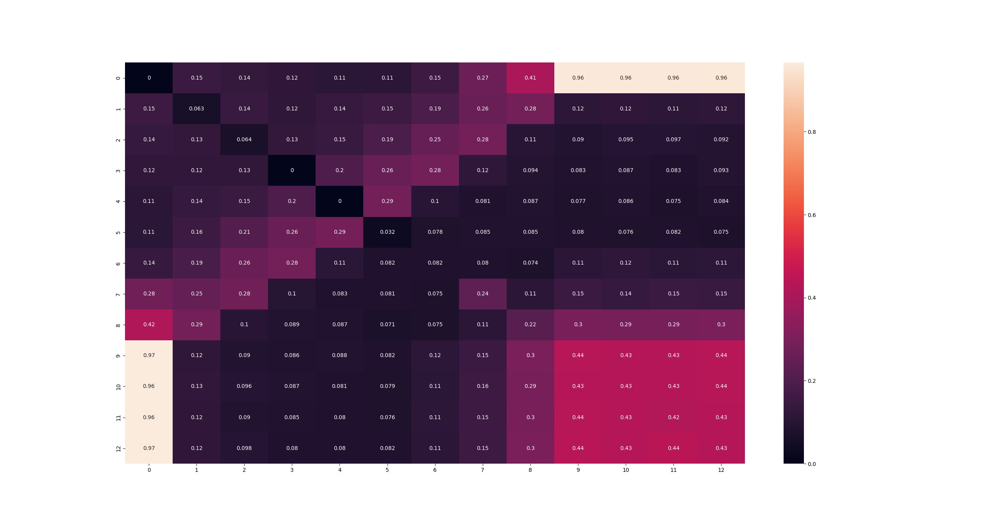

# blackjack-model

Where 0 is ace, 1 is 2 etc., 10, 11, 12 are J, Q, K respectively. 

AI makes decisions according to a simplified https://www.blackjackapprenticeship.com/blackjack-strategy-charts/.

